# Implementations

| Field | Value |
|---|---|
| Status | Living document |
| Updated | 2026-09-01 |
| Scope | Which vaults implement PMVS, how far, and what is next |

PMVS is a specification. This repository carries no contracts on purpose, so that the rules can be read, argued about and implemented independently. This page is where implementations are listed. Each entry says what it conforms to, what it does not, and what the next steps are. A listing is not a conformance claim; a claim MUST name a tag or commit of this repository ([GOVERNANCE.md](./GOVERNANCE.md)).

> Running vault -> honest gap list -> public order of work -> conformance claim against a tag

## Why this page exists

A standard for proving a share price is only convincing if someone is on the path to conforming to it. The vault this standard came from is running today. Saying so, and saying exactly where it falls short, is more useful to a reader than pretending the standard appeared fully formed. It also gives implementers a worked example: here is a real system, here is its distance from each rule, here is the order in which that distance closes.

## Zeit: the precursor deployment

| Field | Value |
|---|---|
| Role | The deployment this standard was extracted from |
| Operator | Autonomous Finance |
| Chain and asset | Polygon; USDC.e |
| Code | Private monorepo; the contracts are not yet published |
| Wire format | Pre-v1, described in the compatibility note at the top of the [EVM annex](./pmvs-evm.md) |
| Conformance claimed | None. Diagnostic only |

### What is built and what the standard adds

```mermaid
%%{init: {"theme":"base","flowchart":{"curve":"linear","nodeSpacing":40,"rankSpacing":56},"themeVariables":{"background":"transparent","primaryTextColor":"#111827","lineColor":"#334155","fontSize":"17px"}}}%%
flowchart LR
    subgraph B["BUILT IN ZEIT"]
        direction TB
        B1["Deposit and withdrawal queue<br/>with cancellation"]
        B2["Epochs, selection hashes,<br/>Merkle claims"]
        B3["Delegated claim intents<br/>(withdraw, bridge, offramp)"]
        B4["Performance fee on a<br/>high-water mark"]
        B5["Instant cash-only route"]
        B6["Valuation engine with<br/>bounded zero-bid rules"]
    end
    subgraph S["THE STANDARD ADDS"]
        direction TB
        S1["Valuation record:<br/>inputs, marks, cash lines"]
        S2["Record hash and attestation<br/>anchored onchain"]
        S3["Deadlines anyone can enforce"]
        S4["A verifier"]
    end
    B --> S

    classDef built fill:#dff3e4,stroke:#27643a,color:#111827,stroke-width:2px;
    classDef adds fill:#e8e3ff,stroke:#57469c,color:#111827,stroke-width:2px;
    class B1,B2,B3,B4,B5,B6 built;
    class S1,S2,S3,S4 adds;
```

The chain layer already follows most of [Part II](./pmvs-settlement.md), because Part II was written from it: the request queue and cancellation, the epoch cursor and its ordering rules, selection hashes, roll and claim events, Merkle claims, delegated EIP-712 intents with nonces and deadlines, the `sunsetting` and `requestsPaused` gates, and the retired state. Fees follow the version-2 rules: a performance fee on the pre-flow supply against a high-water mark, minted as shares, and paid in assets on a final roll.

The valuation engine implements the four safety rules that were closed on 2026-08-18 (rows M1 to M4 below): redemption marks come from onchain payout state; the zero-NAV decision is taken after physical redemption and checked again on every resumption; zero-bid write-offs are bounded and confirmed by a second read; a failed position fetch stops valuation instead of counting as zero.

Two things Zeit does that the standard did not yet describe are now proposed as standard material: the instant cash-only settlement route ([`settlement/instant-cash/1`](./profiles/settlement-instant-cash-1.md)) and delegated claim delivery to a bridge or a venue deposit address (a future `claim-delivery` profile).

### What is not built yet

The gap tables below used to live only in the precursor's private copy of this specification. They are the migration roadmap, and they belong in public. Rows marked closed were checked in code on 2026-09-01.

| Id | Gap | Part | Status |
|---|---|---|---|
| G1 | The roll event carries a storage URL, not a record hash; nothing commits the archive bytes | II | open |
| G2 | Archives carry no operator signature | II | open |
| G3 | The archive shape predates the standard (database identities, JSON numbers, no version or net-price fields) | II | open |
| G4 | No retirement records; the zero-NAV path publishes nothing | II | open |
| G5 | No verifier | II | open |
| G6 | The roll ABI cannot carry an anchor; selection events fire inside the roll | II | open |
| G7 | Request ids passed through a 53-bit conversion | II | closed 2026-08-18 |
| G8 | Shape checks are skipped for empty id arrays | II | disclosed |
| G9 | No timeout or rescue for a selected request that was mis-committed | II | disclosed |
| M1 | Redemption mark floored to whole currency units | III | closed 2026-08-18 |
| M2 | Zero NAV decided before redemption and never revisited | III | closed 2026-08-18 |
| M3 | Zero-bid write-off from a single observation | III | closed 2026-08-18 |
| M4 | A venue API failure produced an empty position list | III | closed 2026-08-18 |
| M5 | Inventory comes from the venue API only, not from chain history | III | open |
| M6 | Floating-point accumulation in marks | III | open |
| M7 | Wall-clock time inside valuation | III | open |
| M8 | Chain reads at `latest`; no pinned block | III | open |
| M9 | Raw venue responses discarded after parsing | III | open |
| M10 | Periodic figures live in a mutable database; no published records | III | open |
| M11 | A yield overlay from another chain is added from unpinned reads | III | open |
| M12 | Engine parameters are code constants, not record fields | III | open |

Three further gaps found in the 2026-09-01 review:

| Id | Gap | Part | Status |
|---|---|---|---|
| Z1 | No valuation record is produced. The archive carries settlement data only. This sits upstream of M5 to M12 | III | open |
| Z2 | The cash perimeter reads the strategy wallet only; the vault buffer and adapter escrow are outside it | III | open |
| Z3 | Cancellation can be switched by the operator, and there are no deadline remedies: the liveness mode Part II calls operator-dependent | II | open |

### Order of work

1. Produce a valuation record from the figures the engine already computes, with a pinned block and raw-response hashes, and put its hash in the price publication. Closes Z1, G1, M8, M9, M12.
2. Make cancellation permanent and add the two deadlines with their permissionless remedies. Closes Z3 and G9.
3. Sum cash across every custody address in the component graph. Closes Z2.
4. Publish a verifier and run it against the records from step 1. Closes G5.
5. Attest and anchor records; add receipt and retirement records. Closes G2, G4, G6.

Items M5, M6, M7, M10 and M11 follow once the record exists, because each of them is a property of what the record contains.

### Conformance matrix

| Claim | Zeit today | Reachable after |
|---|---|---|
| `PMVS Onchain v1` | no | the wire-format migration described in the EVM annex, plus step 2 |
| L1 | no | steps 1 and 4 |
| L2 | no | L1 plus M6, M7, M8, M9 |
| L3 | no | L2 plus M10 |

## Related designs that are not PMVS implementations

[PMF Protocol](https://github.com/PMF-Finance/protocol) is a public vault for the same asset class with a different architecture: positions held inside the vault, entry and exit by signed quotes, a trusted NAV report, and solver-filled trading intents. It is listed here because its `reportHash` field is an unspecified `bytes32` that could carry a PMVS valuation record hash without any contract change. One verifier could then serve both designs.

## How to list an implementation

Open a pull request adding a section with:

1. the tag or commit of this repository the entry is written against;
2. the chain and accounting asset;
3. where the code is and under what licence;
4. the conformance level claimed, if any;
5. the output of a verifier run against at least one published record; and
6. a gap table in the format above.

Maintainers check the verifier output before merging. Do not claim EIP status, audit coverage or production readiness without evidence ([CONTRIBUTING.md](./CONTRIBUTING.md)).

## Copyright

Copyright and related rights in this document are waived under CC0-1.0.
