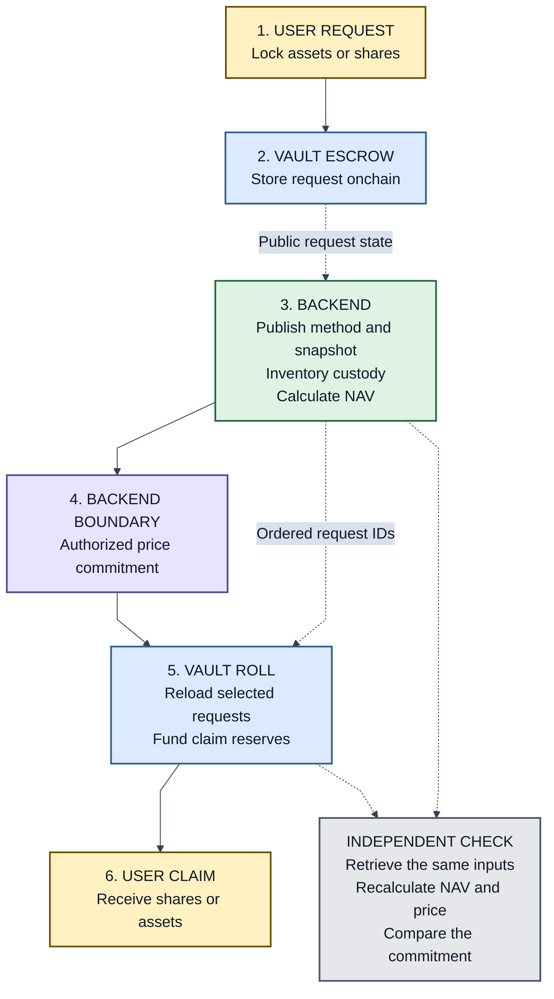
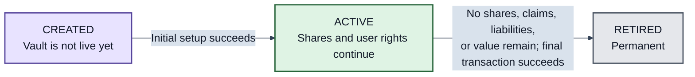

# PMVS: Prediction Market Vault Standard

| Field | Value |
|---|---|
| Status | Pre-EIP review draft |
| Authors | [Ivan Morozov (allquantor)](https://github.com/allquantor), [Christian (smowden)](https://github.com/smowden), [Dinu Barbu (dvinubius)](https://github.com/dvinubius), [Ovidiu Miclea (micovi)](https://github.com/micovi) |
| Created | 2026-08-18 |
| Scope | ERC-20 vault shares backed by prediction-market positions |

PMVS adapts the [Boring Vault architecture](https://github.com/Veda-Labs/boring-vault/blob/39f9d3144fd0416fdcb467ecec916b31457c915d/README.md) separation of shares, accounting, and asset control. It uses [ERC-4626](https://eips.ethereum.org/EIPS/eip-4626) units, conversion, and rounding.

Settlement adapts [ERC-7540's asynchronous request lifecycle](https://eips.ethereum.org/EIPS/eip-7540#request-lifecycle) and [Uniswap's MerkleDistributor](https://github.com/Uniswap/merkle-distributor/blob/25a79e8ec8c22076a735b1a675b961c8184e7931/contracts/MerkleDistributor.sol) claim pattern. PMVS adds epoch batching, price evidence, reserved funding, cancellation, and deadlines through a custom ABI. These are design sources, not conformance claims.

> Public method + frozen market and vault data -> reproducible net asset value (NAV) -> onchain settlement -> shares or funded withdrawal claims

## Why PMVS

A [prediction-market outcome token](https://github.com/gnosis/conditional-tokens-contracts/blob/eeefca66eb46c800a9aaab88db2064a99026fde5/docs/developer-guide.rst#defining-positions) is a collateral-backed claim. A winner-take-all binary token resolves to 0 or 1 unit of collateral. It then stops changing with the market and is redeemed or worthless.

A rolling strategy needs one investor token that survives those resolutions. The strategy can exit old positions and move capital into new markets without issuing investors a new token each time. A PMVS vault may also hold just one outcome position. In either case, its share represents the investor's proportional part of the complete vault NAV and can remain active as long as the vault does.

Wallets, AMMs, lending markets, and aggregators can integrate one stable ERC-20 address. PMVS defines the custody, accounting, settlement, and replacement rules that preserve its meaning.

## How PMVS works

Vault contracts hold requests, issue shares, and fund claims. A replaceable backend publishes its method and snapshot, values every declared custody account, and proposes a price and batch. The valuation authority publishes the price; the settlement authority submits the batch.

The vault recalculates each request output and funds it before a claim. A verifier recomputes NAV and compares the evidence, transaction, and resulting state.

Another backend may use a centralized engine, a different venue, or fully onchain data through the same boundary.

## Lifecycle

Zero NAV is a condition while the vault is Active. It restricts settlement but does not create another lifecycle state. A configuration change also leaves the vault Active and must preserve every share, request, funded claim, and recovery path.

## Read the proposal

Read the main explanation in order:

1. [Core](./pmvs-core.md): what the vault share means and what must never break.
2. [Settlement](./pmvs-settlement.md): how the vault uses a price to turn a request into a funded claim.
3. [PMVS-M1](./pmvs-m1.md): how anyone can reproduce and check that price.

Most readers can stop there. A deployment then selects only the profiles it uses:

- [Gnosis CTF positions](./profiles/position-gnosis-ctf-1.md)
- [Polymarket on Polygon](./profiles/venue-polymarket-1.md)
- [EVM record anchoring](./profiles/anchor-evm-1.md)
- [Arweave record storage](./profiles/storage-arweave-1.md)

Contract implementers and verifier authors use the [EVM implementation annex](./pmvs-evm.md) for exact hashes, structs, calls, selectors, formulas, and events. The [schemas](./schemas/README.md) define machine-readable records. These annexes are reference material, not the introductory reading path.

The [standards and design lineage map](./standards-map.md) says what PMVS adopts, adapts, depends on, or cites as related work.

## Authors

- [Ivan Morozov (allquantor)](https://github.com/allquantor)
- [Christian (smowden)](https://github.com/smowden), [X: @bettercallsmo](https://x.com/bettercallsmo)
- [Dinu Barbu (dvinubius)](https://github.com/dvinubius), [X: @dvinubius](https://x.com/dvinubius)
- [Ovidiu Miclea (micovi)](https://github.com/micovi), [X: @micovi7](https://x.com/micovi7)

The proposal and schemas are released under [CC0-1.0](./LICENSE).
