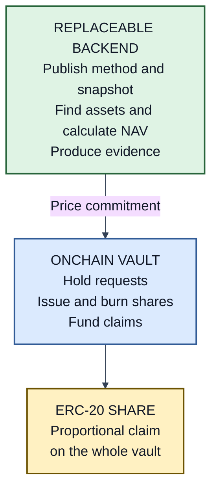

# PMVS Part I: Core

| Field | Value |
|---|---|
| Part | Core |
| Version | 1 (draft) |
| Status | Pre-EIP review draft |
| Authors | [Ivan Morozov (allquantor)](https://github.com/allquantor), [Christian (smowden)](https://github.com/smowden), [Dinu Barbu (dvinubius)](https://github.com/dvinubius), [Ovidiu Miclea (micovi)](https://github.com/micovi) |
| Created | 2026-08-18 |

Capitalized requirement words follow [RFC 2119](https://www.rfc-editor.org/rfc/rfc2119) and [RFC 8174](https://www.rfc-editor.org/rfc/rfc8174).

A PMVS vault turns prediction-market positions into one [ERC-20](https://eips.ethereum.org/EIPS/eip-20) share. The vault may hold one outcome position or many. Each share represents the same proportional part of the vault's net asset value (NAV).

PMVS adapts [Boring Vault's](https://github.com/Veda-Labs/boring-vault/blob/39f9d3144fd0416fdcb467ecec916b31457c915d/README.md) separation of asset control, shares, and accounting. It adds evidence, asynchronous settlement, and replaceable backends.

> Declared vault configuration -> Core -> stable share rules and a fixed backend boundary

## One vault, two parts

The onchain vault owns the parts that move value: shares, user requests, settlement, reserves, and claims. It MUST NOT query a venue or calculate NAV.

The backend finds every asset and liability, calculates NAV, and proposes a price and batch. It never controls user funds. The valuation authority publishes the price commitment; the settlement authority submits the batch.

The boundary between them is fixed. Another backend may use a centralized engine, a different venue, or fully onchain data without changing the share or settlement contract. [Settlement](./pmvs-settlement.md) defines the user flow; [M1](./pmvs-m1.md) defines the price evidence.

A profile is a versioned rule set selected by the vault. Profiles define how to value positions, read a venue, anchor records, or store evidence. Replacing one requires a new active configuration.

## What a share means

The active configuration declares the accounting asset, share decimals, initial price, custody accounts, contracts, authorities, profiles, and behavior-changing parameters.

These rules MUST always hold:

| Invariant | Meaning |
|---|---|
| One share class | Every share has the same proportional claim on the whole vault. |
| Complete accounting | NAV includes every controlled asset, receivable, reserve, claim, and liability unless a selected profile gives a reason to exclude it. |
| No internal profit | Moving value between declared custody accounts does not change NAV. |
| Fair conversion | Deposit and withdrawal prices use complete NAV, including liabilities and funded claims. |
| Exact units | Every amount has a declared base unit, integer bound, and rounding rule. |
| Controlled supply | Shares change only through declared deposits, withdrawals, fees, migrations, burns, or profile actions. |
| Durable rights | A configuration change cannot erase a request, funded claim, or recovery path. |

PMVS does not imply ERC-2612, ERC-4626, ERC-7540, or ERC-7575 conformance. An implementation may claim one of those standards only if it implements that standard in full.

## Changing the vault

The active configuration is recorded in a signed `components` record. The share exposes that record's hash, generation, activation nonce, and anchor.

Governance, valuation, settlement, fee, and custody powers MUST be separate, explicit roles. The configuration names every holder, delegate, recovery source, and rotation authority.

A replacement MUST be signed and anchored before activation. It names the current configuration, advances generation and nonce once, passes its declared checks, and performs only its declared migration. It MUST preserve every share and user right, carry forward the fee high-water mark, and MUST NOT raise the performance-fee rate for the epoch then awaiting settlement; activation declares the checks that prove both. Failure leaves the prior configuration active.

An anchor change also moves the latest record checkpoints in the same transaction. The [EVM annex](./pmvs-evm.md#configuration-activation) defines the exact activation and migration calls.

## Records and trust

A PMVS record is canonical JSON with a content hash and authorized signature. An onchain anchor orders those hashes. Full bytes may live elsewhere.

Records cover configuration, valuation, settlement, receipts, retirement, corrections, gaps, and independent watcher observations. The [schema](./schemas/pmvs-envelope-v1.schema.json) defines their exact kinds and fields.

An anchored record proves who committed which hash and when. It does not prove the record is true. A verifier MUST retrieve the bytes, reproduce the hash, check authority and order, then compare the claims with independent chain and venue evidence. Missing or unknown required data MUST fail closed.

When verification fails, treat every later record as unproven until corrected. A broken chain of custody taints what follows it, not just the failing record. The standard supplies evidence, not recourse: dishonesty becomes detectable after the fact, and nothing claws back a settled epoch.

A correction may explain or annotate, but MUST NOT change the economics of an already-settled epoch: never NAV, price per share, fees, or outputs. After retirement the vault stream accepts only such non-economic corrections.

## Lifecycle and user rights

Zero NAV is an Active condition, not a new state. It stops price-dependent settlement but preserves cancellation, funded claims, and recovery rights.

Retirement is permanent. It requires zero supply, requests, claims, reserves, positions, liabilities, and unresolved recovery rights. Cleanup happens before the final transaction. Failure leaves the vault Active.

A recovery right is a recorded claim on vault value outside normal requests and funded claims: funds stranded at a wrong address under an earlier configuration, or an obligation named in a retirement-recovery manifest. A right exists once recorded, belongs to its named holder, and resolves only through its recorded resolution action or by a waiver signed by its holder.

## Conformance

`PMVS Onchain v1` covers the share, active-configuration discovery, backend boundary, requests, settlement, reserves, claims, replacement, and retirement. It does not prove that backend evidence or NAV is correct.

Full-system levels are cumulative:

| Level | What is proved |
|---|---|
| L1 | Complete custody, inventory, inputs, price evidence, settlement, reserves, and receipt agree. |
| L2 | L1 plus deterministic replay reproduces NAV, price, fees, and settlement. |
| L3 | L2 plus every required reporting slot has a valuation or explicit gap. |

Each claim names the Core version, profiles, anchor mode, and request-liveness mode. A diagnostic result, valid schema, or signed record alone is not conformance. Unknown profiles, incomplete inventory, stale evidence, broken history, wrong arithmetic, or short reserves invalidate dependent claims.

## References

- [Part II: settlement](./pmvs-settlement.md)
- [PMVS-M1 valuation](./pmvs-m1.md)
- [EVM implementation annex](./pmvs-evm.md)
- [Schemas](./schemas/README.md)
- [Standards and design lineage](./standards-map.md)

## Copyright

Copyright and related rights in this document are waived under CC0-1.0. Third-party material remains under its own license.
