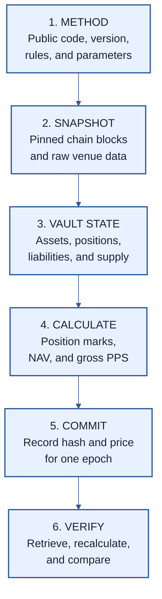

# PMVS Part III: Offchain valuation profile PMVS-M1

| Field | Value |
|---|---|
| Part | M1 offchain valuation profile |
| Version | 1 (draft) |
| Status | Pre-EIP review draft |
| Authors | [Ivan Morozov (allquantor)](https://github.com/allquantor), [Christian (smowden)](https://github.com/smowden), [Dinu Barbu (dvinubius)](https://github.com/dvinubius), [Ovidiu Miclea (micovi)](https://github.com/micovi) |
| Created | 2026-08-18 |
| Requires | PMVS Parts I and II |

[RFC 2119](https://www.rfc-editor.org/rfc/rfc2119) and [RFC 8174](https://www.rfc-editor.org/rfc/rfc8174) define requirement words.

> Public method + frozen venue data + pinned vault state -> M1 -> net asset value and price-per-share record

Most large prediction markets are not fully onchain. [Polymarket](https://docs.polymarket.com/trading/overview) matches orders offchain, and [Kalshi](https://docs.kalshi.com/api-reference/market/get-market-orderbook) publishes its books through an API. The vault's shares and balances may be onchain while the prices needed for net asset value (NAV) are not.

M1 makes that bridge auditable. For each settlement epoch, the backend publishes its valuation method and the exact onchain and offchain inputs it used. The valuation authority, which is allowed to publish prices, commits the record and price onchain. Anyone can retrieve the inputs, run the method, and compare the NAV and price per share (PPS).



## What gets published

An epoch is one settlement round. Its valuation record binds:

| Part | Contents |
|---|---|
| Method | Public source, code build, version, hashes, and parameters |
| Venue snapshot | Raw order books, resolution data, source, and observation time |
| Vault snapshot | Pinned blocks, custody accounts, balances, positions, liabilities, and share supply |
| Result | Each position mark, NAV, gross PPS, and expiry |
| Commitment | The hash of the complete record, anchored for that epoch and published with the price |

Raw data may live outside the chain, but the record stores its hash and retrieval locations. Changing the data changes the hash. A hash does not prove that the data is true or complete, so a verifier MUST still check its source, time, and coverage.

[Settlement Merkle roots](./pmvs-evm.md#merkle-claims) have a separate job. They commit the shares or assets owed to selected requests after the price is set. They do not calculate or prove NAV.

## How M1 calculates the price

The backend pins each chain to one block and each venue response to its raw bytes and timestamp. It then rebuilds the complete portfolio from every declared custody account. Missing data stops valuation; it is never treated as zero.

A resolved position uses its onchain payout. A live position uses the captured bids, from best to worst, less the declared exit cost. The venue profile defines the exact price scale, fees, collateral conversion, and limits on unsold exposure.

```text
gross assets = cash + position values
NAV          = max(gross assets - liabilities, 0)

PPS = floor(NAV * 10^shareDecimals * 10^18
            / (total share supply * 10^assetDecimals))
```

Cash includes every controlled balance of the accounting asset, which is the asset used to measure NAV. Liabilities are subtracted once so nothing is counted twice.

## How anyone verifies it

A verifier:

1. checks that the published method and parameters match the active vault configuration;
2. retrieves every raw venue response and checks its hash and time;
3. reads the stated onchain blocks and rebuilds the complete custody inventory;
4. reruns every mark and accounting step; and
5. checks that the epoch, PPS, expiry, and valuation-record hash match the onchain commitment. NAV lives inside the record; the commitment stores only the price.

Missing, stale, unsupported, or inconsistent evidence fails verification. The [settlement profile](./pmvs-settlement.md) checks that the vault used that price and funded every resulting claim.

M1 v1 standardizes the evidence and checks. Each backend still has its own engine. Anyone can rerun the named public implementation, but PMVS has no universal reference engine yet. This supports L1 verification, not L2 or L3. A future closed engine can add cross-implementation replay without changing the vault's [Settlement boundary](./pmvs-settlement.md#backend-boundary).

The [M1 machine rules](./pmvs-evm.md#m1-valuation-mechanics) define exact timing, arithmetic, ordering, failure cases, and record fields. The [schemas](./schemas/README.md) define their machine-readable shape.

## References

- [Core](./pmvs-core.md)
- [Settlement](./pmvs-settlement.md)
- [Gnosis CTF position profile](./profiles/position-gnosis-ctf-1.md)
- [Polymarket venue profile](./profiles/venue-polymarket-1.md)
- [Schemas](./schemas/README.md)

## Copyright

Copyright and related rights in this document are waived under CC0-1.0. Third-party material remains under its own license.
