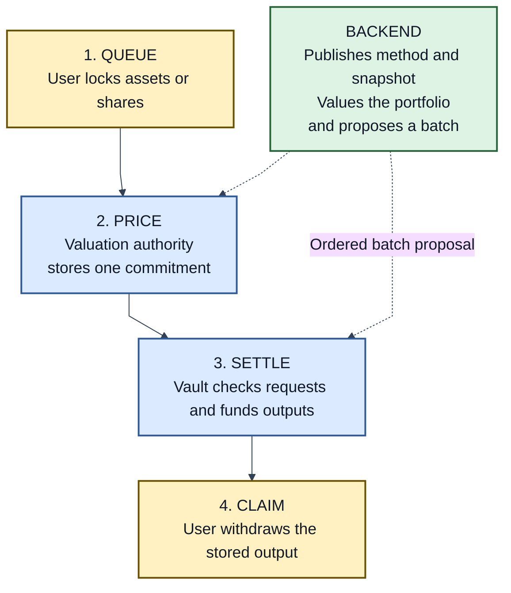

# PMVS Part II: Vault settlement

| Field | Value |
|---|---|
| Part | Settlement |
| Version | 1 (draft) |
| Status | Pre-EIP review draft |
| Authors | [Ivan Morozov (allquantor)](https://github.com/allquantor), [Christian (smowden)](https://github.com/smowden), [Dinu Barbu (dvinubius)](https://github.com/dvinubius), [Ovidiu Miclea (micovi)](https://github.com/micovi) |
| Created | 2026-08-18 |
| Requires | PMVS Part I (Core) |

Capitalized requirement words follow [RFC 2119](https://www.rfc-editor.org/rfc/rfc2119) and [RFC 8174](https://www.rfc-editor.org/rfc/rfc8174).

[Core](./pmvs-core.md) defines the vault share. Here, users lock funds onchain, a backend proposes a price and batch, and the vault verifies and funds the result. The backend never holds user funds.

> Queued request + published price commitment -> Settlement -> fully funded claim

## Why requests can wait

A prediction-market position has a natural endpoint: hold it to resolution and redeem the payout. Selling earlier requires counterparties in that market's order book. Depth may be too small for a vault-sized exit: [Polymarket warns](https://docs.polymarket.com/concepts/prices-orderbook) that a large order can move the price significantly. Making each withdrawal trigger an immediate sale passes that spread and price impact to vault holders.

PMVS separates the request from settlement. Deposits and withdrawals can settle together at one epoch and one price. If 100 enters while 80 leaves, incoming cash can fund the 80 and only the net 20 must be deployed. The strategy may also use existing cash, unwind positions deliberately, or wait for resolution. Delay does not excuse underfunding or hidden pricing: cancellation and deadline rights still apply.

The same structure already exists elsewhere. [ERC-7540](https://eips.ethereum.org/EIPS/eip-7540) defines asynchronous vault requests. Regulated long-term funds align redemptions with asset liquidity through [periodic dealing and notice periods](https://handbook.fca.org.uk/handbook/coll15/coll15s8). Not every flow must wait: a vault may add an immediate deposit route when it can price safely. PMVS v1 standardizes the queued route; any immediate route must be separately declared and preserve the same accounting and user rights.

## The flow



This follows the Pending, Claimable, and Claimed lifecycle in [ERC-7540](https://eips.ethereum.org/EIPS/eip-7540#request-lifecycle). PMVS adds shared epochs, authenticated price evidence, funded Merkle claims, cancellation, and deadlines. It uses a custom interface and does not claim ERC-7540 conformance.

### 1. Queue

A deposit locks accounting assets in the vault. A withdrawal locks vault shares. Each request records its owner and amount onchain.

The owner MAY cancel while the request is pending and recover the exact input. A delegate may submit a request or claim, but delegation does not transfer ownership.

"Deadline remedy" appears throughout this Part: in `bounded` request-liveness mode, once a deadline passes, anyone, not just the operator, may refund an unselected request's locked input or deliver a selected request's stored output. See [When normal settlement stops](#when-normal-settlement-stops).

### 2. Price

[M1](./pmvs-m1.md) defines how the backend freezes one portfolio snapshot, reconstructs custody, calculates NAV, and produces the price evidence. The backend proposes an ordered batch. The valuation authority publishes:

<a id="backend-boundary"></a>
<a id="backend-interface"></a>
<a id="2-backend-interface"></a>

```text
(epoch, priceAttempt) -> (components, grossPps, valuationRecord, validUntil)
```

(The wire call orders its arguments differently; the [EVM annex](./pmvs-evm.md#backend-boundary) is exact.)

The boundary profile is `backend/settlement/1`. `components` identifies the active vault configuration. `grossPps` is the pre-fee price per share. `valuationRecord` points to the evidence. `validUntil` limits how long the price may be used.

The commitment is immutable. An expired attempt may be replaced by the next attempt, but it may not be overwritten. The settlement contract MUST load the stored commitment. It MUST NOT accept a caller-supplied price, cache, or fallback.

### 3. Settle

The settlement authority submits ordered deposit and withdrawal request ids. The contract then:

1. reloads every request from storage;
2. checks the active configuration, price attempt, evidence hash, and expiry;
3. calculates each output from the stored input and final price;
4. checks the ordered Merkle roots and totals;
5. mints or burns shares and funds separate claim reserves; and
6. marks the epoch processed.

This transaction is the roll. All six steps happen together. Any mismatch MUST revert the entire roll. The contract does not decide whether the backend's NAV is correct. PMVS verification checks that separately.

Deposits receive shares. Withdrawals receive assets. The final price equals the published gross price after the declared performance fee. All arithmetic, rounding, fee, epoch, batch-size, and reserve rules are fixed in the [EVM settlement mechanics](./pmvs-evm.md#settlement-mechanics).

The batch takes settleable pending requests oldest-first, up to a declared per-leg cap; deposits and withdrawals settle as separate legs. A request the batch does not take stays pending: it keeps its place for a later epoch, may be cancelled while pending, and gains its deadline remedy if never selected. A zero output on a non-final withdrawal also stays pending. Nothing about your request changes by being skipped.

### 4. Claim

Settlement stores one Merkle root for deposit shares and one for withdrawal assets. Each selected request has one stored output and one leaf index in its ordered tree.

The contract MUST verify the owner, amount, leaf index, proof, root, and unused claim state before paying. It MUST debit only the matching reserve and prevent replay. A funded claim remains payable after a pause, configuration replacement, or zero NAV. Retirement cannot begin while one exists.

The claim pattern adapts [Uniswap's MerkleDistributor](https://github.com/Uniswap/merkle-distributor/blob/25a79e8ec8c22076a735b1a675b961c8184e7931/contracts/MerkleDistributor.sol). [Merkle claims](./pmvs-evm.md#merkle-claims) defines the exact PMVS tree and cites its other sources.

## Guarantees

| Rule | Required result |
|---|---|
| One batch price | Every selected request uses the same authenticated snapshot and price attempt. |
| Stored inputs | Settlement reloads requests and calculates outputs. Calldata cannot rewrite them. |
| Full funding | Every selected output is reserved before the roll succeeds. |
| Durable rights | Pending requests remain cancellable or gain a deadline remedy. Funded claims remain payable once. |
| Independent proof | Records bind the price evidence, batch, transaction, events, and resulting state. |

Claim reserves MUST NOT be lent, staked, bridged, pledged, counted as free NAV, approved for another use, or paid from another reserve. A configuration change MUST preserve every pending request, reserve, and funded claim; if it migrates them to new components, exactly one valid claim path remains.

## When normal settlement stops

<a id="zero-nav-and-retirement"></a>

| Situation | Result |
| --- | --- |
| A request or funded claim passes its deadline | Bounded mode lets anyone complete the refund or delivery. Operator-dependent mode has no deadline and is not production-ready. |
| NAV is zero | Record the zero price and settle no requests. The roll changes no funds, shares, claims, reserves, or fees; deposits cannot settle until a positive price returns. Cancellations and funded claims continue. |
| The last holders withdraw | Allow this only when no other registered asset or position remains. Divide all free accounting assets by a fixed pro-rata rule. |
| The vault retires | First clear all shares, assets, requests, claims and their funding, positions, liabilities, and recovery rights. The final transaction makes retirement permanent. If it fails, the vault stays Active. |

The [EVM annex](./pmvs-evm.md#settlement-mechanics) defines the exact checks and calls.

## Verification

Normal rolls use a `settlement-archive`; zero-NAV rolls use `winddown-opened`; retirement uses `retirement-final`. The [schema](./schemas/pmvs-envelope-v1.schema.json) defines each record. The selected [anchor profile](./profiles/anchor-evm-1.md) binds it to the action.

Apply [Core's cumulative conformance levels](./pmvs-core.md#conformance). Settlement MUST prove complete request history, authenticated pricing, exact arithmetic, funded reserves, valid claims, transaction effects, and any required deadline or retirement state.

This profile (`backend/settlement/1`) requires exact transfers, 18-decimal shares, and `10^18` prices. Vaults with other decimals need another settlement profile. Transfer fees, rebases, unsafe hooks, or blocked remedies also require another profile. See [standards and design lineage](./standards-map.md) for external conformance boundaries.

## References

- [Core](./pmvs-core.md)
- [EVM implementation annex](./pmvs-evm.md)
- [PMVS-M1 valuation](./pmvs-m1.md)
- [Envelope schema](./schemas/pmvs-envelope-v1.schema.json)
- [Standards and design lineage](./standards-map.md)
- [ERC-7540: Asynchronous ERC-4626 Tokenized Vaults](https://eips.ethereum.org/EIPS/eip-7540)
- [FCA long-term asset fund redemption rules](https://handbook.fca.org.uk/handbook/coll15/coll15s8)
- [Polymarket prices and order books](https://docs.polymarket.com/concepts/prices-orderbook)

## Copyright

Copyright and related rights in this document are waived under CC0-1.0. Third-party material remains under its own license.
