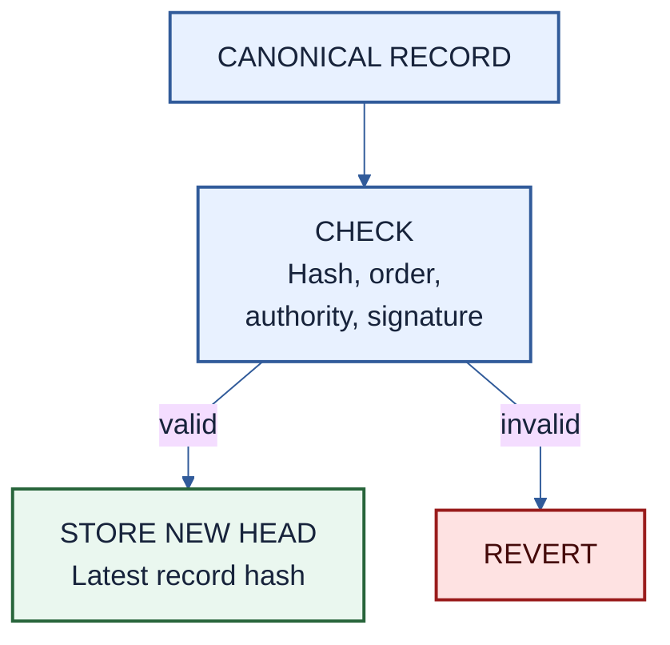
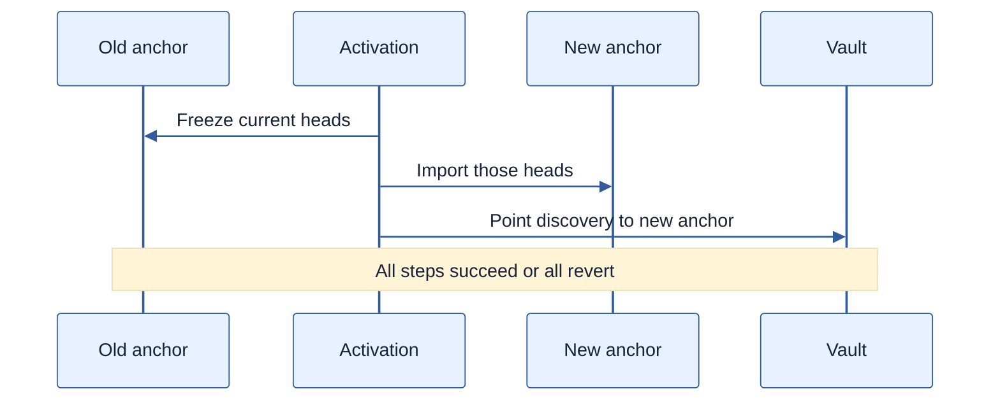

# PMVS anchor profile: `anchor/evm/1`

| Field | Value |
|---|---|
| Profile | `anchor/evm/1` |
| Version | 1 (draft) |
| Status | Pre-EIP review draft |
| Authors | [Ivan Morozov (allquantor)](https://github.com/allquantor), [Christian (smowden)](https://github.com/smowden), [Dinu Barbu (dvinubius)](https://github.com/dvinubius), [Ovidiu Miclea (micovi)](https://github.com/micovi) |
| Created | 2026-08-21 |
| Requires | PMVS Part I |

[RFC 2119](https://www.rfc-editor.org/rfc/rfc2119) and [RFC 8174](https://www.rfc-editor.org/rfc/rfc8174) define requirement words.

The Parts and selected profiles define what records mean. This profile gives their hashes a public order and stores the latest hash for the vault and each watcher. That latest hash is the record head. The selected [storage profile](./storage-arweave-1.md) keeps the full bytes retrievable.

> Record hash + authorized signature -> this profile -> latest ordered hash onchain

The anchor proves who committed a hash and which hash came before it. It does not prove that the record is true.

## Record order

Initialization binds the anchor to one vault, called the subject, and one authority resolver. The resolver is the contract that returns the authorized signer and any required settlement wrapper. The first vault record is its components record at sequence `0`. Each later vault record names the prior hash and uses the next sequence.

Watchers are independent observers. They have separate signer-derived streams and cannot advance the vault's own record history. A successful commit checks the canonical digest and current authority, stores the new head, and emits the anchor event. Any failure reverts every effect.

The resolver and anchor code are pinned in the active configuration. Authority rotation remains visible through record and event history. The [EVM annex](../pmvs-evm.md#authority-and-anchor) defines exact signatures, selectors, stream ids, sequencing, and events.

## Binding records to actions

Settlement records can use one of two modes:

| Mode | Meaning |
|---|---|
| Registry | The record is anchored before the action. A failed action can leave an unused record. |
| Atomic | The settlement wrapper commits the record and performs the action in one transaction. A failure leaves neither effect. |

Registry mode permits normal and zero-NAV settlement records but not final retirement. An unused registry record returns `UNEXECUTED_ANCHOR` and a retry must identify it. Atomic mode allows only the declared settlement wrapper to commit protected action records.

Retirement is always atomic. Its successful commit also sets the permanent subject-finalized flag. After that, the vault stream accepts only non-economic corrections.

## Replacing an anchor

Changing the anchor, resolver, action mode, or protected wrapper requires a new components record and one atomic activation transaction.

The old anchor freezes once. The empty new anchor imports the vault head and every continuing watcher head in the same order. Discovery changes only after those checks pass. A revert leaves the old anchor active.

The [EVM annex](../pmvs-evm.md#record-anchor) defines the exact freeze, import, receipt, and event rules.

## Verification boundary

A verifier still MUST retrieve the record bytes, reproduce their hash, check storage availability, pin anchor and resolver code, recover authority history, and compare every claim with independent evidence. A URI or successful anchor transaction is not proof of record truth.

## References

- [Core records](../pmvs-core.md#records-and-trust)
- [EVM implementation annex](../pmvs-evm.md)
- [Settlement](../pmvs-settlement.md)
- [Arweave storage profile](./storage-arweave-1.md)

## Copyright

Copyright and related rights in this document are waived under CC0-1.0. Third-party material remains under its own license.
