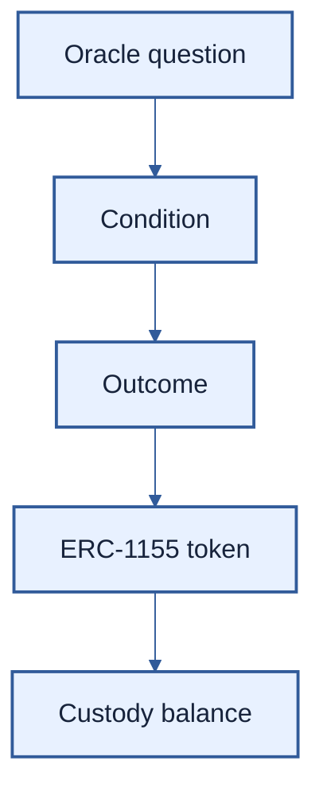

# PMVS position profile: Gnosis Conditional Tokens

| Field | Value |
|---|---|
| Profile | `position/gnosis-ctf/1` |
| Version | 1 (draft) |
| Status | Pre-EIP review draft |
| Authors | [Ivan Morozov (allquantor)](https://github.com/allquantor), [Christian (smowden)](https://github.com/smowden), [Dinu Barbu (dvinubius)](https://github.com/dvinubius), [Ovidiu Miclea (micovi)](https://github.com/micovi) |
| Created | 2026-08-21 |
| Requires | PMVS Parts I and III; ERC-165; ERC-1155 |

This profile gives [M1](../pmvs-m1.md) the identity, balance, and payout of a [Gnosis Conditional Tokens](https://github.com/gnosis/conditional-tokens-contracts/blob/eeefca66eb46c800a9aaab88db2064a99026fde5/docs/developer-guide.rst#defining-positions) outcome token. A venue profile may add market data and collateral conversion. The [`position` schema](../schemas/position-gnosis-ctf-1.schema.json) defines the fields.

> CTF contract facts + custody reads -> this profile -> verified identity, balance, and payout



## Identity

A position is `(chainId, positionContract, positionId)`. Token id alone is not enough.

```text
conditionId = keccak256(
  abi.encodePacked(address oracle, bytes32 questionId, uint256 outcomeSlotCount)
)
collectionId = CTHelpers.getCollectionId(parentCollectionId, conditionId, indexSet)
positionId = uint256(
  keccak256(abi.encodePacked(address collateralToken, bytes32 collectionId))
)
```

The verifier MUST reproduce the exact CTF derivation and match the venue instrument. Identity proves no price.

## Balance

ERC-1155 has no token-id enumeration. Scan every `TransferSingle` and `TransferBatch` event touching declared custody from genesis or a checkpoint that proves the complete starting set. Then verify each emitter and read each balance at one pinned block.

The verifier checks CTF code and proxy state. It requires ERC-165 support for `0x01ffc9a7` and ERC-1155 `0xd9b67a26`, rejection of `0xffffffff`, the `ConditionPreparation` event, `getOutcomeSlotCount`, and valid index-set bounds. It scans `ApprovalForAll`, confirms `isApprovedForAll`, and retains revoked approvals as false.

A venue-reported size cannot replace the custody balance. A missing or non-unique token preimage returns `UNVERIFIABLE_INVENTORY`.

## Payout

A condition is resolved when its payout denominator is positive.

```text
numerator = sum(payoutNumerators[i] for each outcome bit in indexSet)
payout    = floor(quantity * numerator / payoutDenominator)
```

Use CTF's checked `uint256` multiplication, not wider `mulDiv`; intermediate overflow reverts. `redeemPositions` burns the account's full balance for each listed index set. Partial redemption therefore needs a dedicated account.

A root collection pays collateral. A child collection pays a parent position that still needs its own proof and valuation. Oracle correctness, economic meaning, and Polymarket Combo positions are outside this profile.

## References

- [Polymarket venue profile](./venue-polymarket-1.md)
- [`CTHelpers.sol` at `eeefca6`](https://github.com/gnosis/conditional-tokens-contracts/blob/eeefca66eb46c800a9aaab88db2064a99026fde5/contracts/CTHelpers.sol)
- [`ConditionalTokens.sol` at `eeefca6`](https://github.com/gnosis/conditional-tokens-contracts/blob/eeefca66eb46c800a9aaab88db2064a99026fde5/contracts/ConditionalTokens.sol)

## Copyright

Copyright and related rights on this document's text are waived under CC0-1.0.
