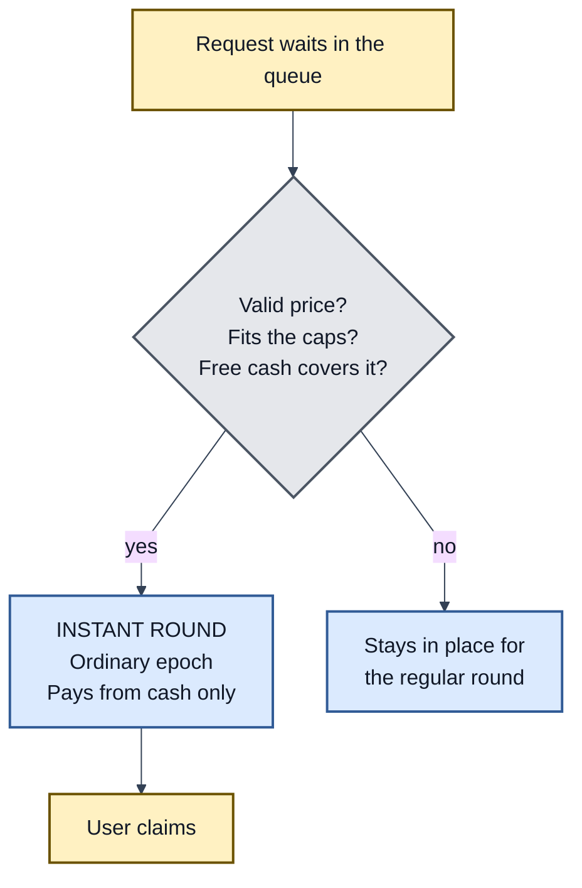

# PMVS settlement profile: `settlement/instant-cash/1`

| Field | Value |
|---|---|
| Profile | `settlement/instant-cash/1` |
| Version | 1 (draft) |
| Status | Pre-EIP review draft |
| Authors | [Ivan Morozov (allquantor)](https://github.com/allquantor) |
| Created | 2026-09-01 |
| Requires | PMVS Parts I and II; `settlement/epoch-merkle/1` |

Capitalized requirement words follow [RFC 2119](https://www.rfc-editor.org/rfc/rfc2119) and [RFC 8174](https://www.rfc-editor.org/rfc/rfc8174).

[Part II](../pmvs-settlement.md) standardises the queued route and says that any immediate route "must be separately declared and preserve the same accounting and user rights". This profile is that declaration. It lets a vault settle small requests quickly, from cash it already holds, without selling anything and without weakening any rule of the regular round.

> Queued request + valid price + free cash -> this profile -> a short round that pays from cash, or does nothing

## Why an instant route

A regular round waits for the vault's cadence, freezes venue activity, values every position and may sell some of them to raise cash. That is the right process for a large withdrawal. It is a poor experience for a small one when the vault already holds enough cash to pay it. An instant route lets those requests settle in minutes instead of days, while the regular round keeps handling everything the instant route cannot.

The risk of any fast path is that it quietly becomes a second set of rules. This profile prevents that by making an instant round an ordinary epoch with restricted selection, so that every guarantee of Part II applies unchanged.



## What an instant round is

An instant round is an epoch. Every rule of `settlement/epoch-merkle/1` applies to it: stored inputs, outputs recomputed by the contract, funded reserves, records, claims, cancellation and deadlines. This profile only restricts which requests the round may select and what it may do to raise cash.

The settlement record gains one field, `selectionMode`, which is `queued` for a regular round and `instant-cash` for a round under this profile.

## Selection rules

1. An instant round MUST use a price commitment that is valid at settlement, that is `block.timestamp <= validUntil`. It MAY use a fresh price attempt or the latest unexpired one.
2. An instant round MUST select only requests whose full output can be paid from accounting-asset cash that is free at settlement time. Free cash follows the reserve rules of Part II: claim reserves and pending liabilities are never free.
3. Withdrawals are selected oldest-first, as in Part II, up to `perRequestCap` and `perBatchCap`. A withdrawal that does not fit stays pending in its place and keeps every right it had.
4. An instant deposit MUST NOT bear a performance fee on principal that earned nothing. An implementation that prices deposits at the post-fee `ppsFinal` on the pre-flow supply satisfies this rule. An implementation whose deposit pricing cannot guarantee it MUST defer instant deposits on any epoch whose `grossPps` exceeds the high-water mark.
5. An instant round MUST NOT sell, redeem, unwrap or otherwise change any position. If free cash is short, the round settles fewer requests or none. It never liquidates. The rule is structural: the code path that resumes an interrupted instant round MUST still refuse to liquidate.
6. An instant round MUST NOT change the order of the regular queue. Requests it did not select are settled by the regular route exactly as if the instant round had not happened.

## Freeze rules

A venue profile may require a settlement freeze before a regular round, so that no fill changes the snapshot. An instant round MAY skip the venue-quiescence part of that freeze, on two conditions:

- the round reads the controlled cash balances onchain at settlement time and aborts on any shortfall, so a fill that settles during the round can only shrink the batch and never underpay it; and
- the remaining race, a resting venue order filling between the cash read and the settlement transfer, is bounded by `perBatchCap` and disclosed in the settlement record.

New venue orders MUST still be blocked for the duration of the round.

## Parameters

Declared under `profileParameters["settlement/instant-cash/1"]` in the components record:

| Parameter | Type | Meaning |
|---|---|---|
| `perRequestCap` | uint | Largest output for one selected request, in accounting-asset units |
| `perBatchCap` | uint | Largest total output for one instant round |
| `minDeposit` | uint | Smallest deposit eligible for instant selection; zero disables instant deposits |
| `batchWindowSeconds` | uint | How long requests accumulate before an instant round may start |
| `minRollIntervalSeconds` | uint | Shortest gap between two instant rounds |
| `depositFeeGuard` | `"net-price"` or `"defer"` | Which of the two rule-4 behaviours the implementation uses |

All six MUST be present when the profile is selected. A zero `perBatchCap` disables the route without removing the profile from the configuration.

## Records and verification

The settlement record for an instant round carries `selectionMode: "instant-cash"`, the six parameters as they applied, the free-cash figure the round read, and `freezeMode: "fast"` when the venue-quiescence freeze was skipped.

A verifier checks, in addition to the Part II checks, that every selected output fits the caps, that the sum of outputs does not exceed the recorded free cash, that no position changed between the round's pinned pre-state and post-state, and that no instant deposit bore a fee under rule 4. Three result codes are added:

```text
INSTANT_CAP_EXCEEDED, INSTANT_LIQUIDATION, INSTANT_FEE_ON_PRINCIPAL
```

## Source

This profile generalises the guarded instant route in the precursor deployment ([IMPLEMENTATIONS.md](../IMPLEMENTATIONS.md)). There, deposits and withdrawals are configured separately, the no-liquidation rule is enforced by the resume policy, and the fast freeze is justified by re-reading cash before settlement. The profile keeps those properties and leaves the deployment's configuration shape behind.

## Copyright

Copyright and related rights on this document's text are waived under CC0-1.0.
