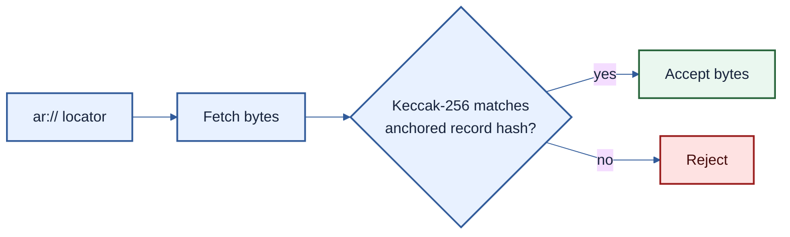

# PMVS storage profile: `storage/arweave/1`

| Field | Value |
|---|---|
| Profile | `storage/arweave/1` |
| Version | 1 (draft) |
| Status | Pre-EIP review draft |
| Authors | [Ivan Morozov (allquantor)](https://github.com/allquantor), [Christian (smowden)](https://github.com/smowden), [Dinu Barbu (dvinubius)](https://github.com/dvinubius), [Ovidiu Miclea (micovi)](https://github.com/micovi) |
| Created | 2026-08-18 |
| Requires | PMVS Part I |

This optional profile lets a verifier retrieve the full PMVS record behind the current anchored hash from Arweave. Vault contracts use only the hash. They never depend on Arweave or a gateway.

> Canonical record bytes + anchored hash -> this profile -> retrievable matching bytes

An Arweave transaction id is the Base64URL encoding of `SHA-256(signature)`. It identifies an upload, not the PMVS record hash. The same record bytes may be uploaded again under another transaction id without changing their PMVS hash.

Publication MUST:

1. keep the canonical bytes under operator control;
2. wait for the declared confirmation depth;
3. fetch through two independent paths and match `keccak256(bytes)` to the anchor; and
4. republish identical bytes if a locator later fails.

For [ANS-104](https://github.com/ArweaveTeam/arweave-standards/blob/986f9e9a9b5952d8a869161209cd68d8b51c4626/ans/ANS-104.md), record the parent transaction, DataItem id, offset, and length. Verify the DataItem signature and bounds before hashing the extracted bytes.

Tags and gateway URLs help discovery but are not evidence. Start from the anchor. The Arweave key authenticates storage, not the PMVS record authority. Upload does not end the operator's retention duty.

## References

- [Arweave HTTP API](https://docs.arweave.org/developers/arweave-node-server/http-api)
- [Core records](../pmvs-core.md#records-and-trust)
- [EVM anchor profile](./anchor-evm-1.md)

## Copyright

Copyright and related rights in this document are waived under CC0-1.0. Third-party material remains under its own license.
