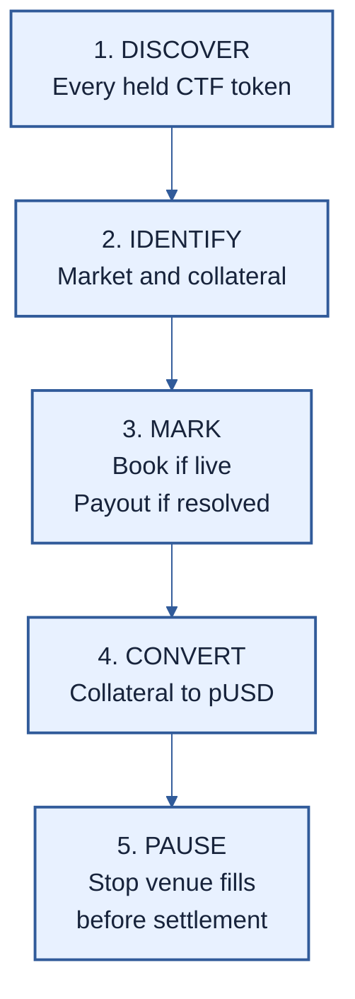

# PMVS venue profile: `venue/polymarket/1`

| Field | Value |
|---|---|
| Profile | `venue/polymarket/1` |
| Version | 1 (draft) |
| Status | Pre-EIP review draft |
| Authors | [Ivan Morozov (allquantor)](https://github.com/allquantor), [Christian (smowden)](https://github.com/smowden), [Dinu Barbu (dvinubius)](https://github.com/dvinubius), [Ovidiu Miclea (micovi)](https://github.com/micovi) |
| Created | 2026-08-18 |
| Requires | PMVS Parts I through III; `position/gnosis-ctf/1` |

This profile tells [M1](../pmvs-m1.md) how to value Polymarket positions on Polygon: find custody, prove each [Gnosis Conditional Tokens (CTF)](./position-gnosis-ctf-1.md) token, use a live book or resolved payout, convert collateral to pUSD, then pause fills before settlement. Missing evidence blocks valuation.

> Verified CTF holdings + Polymarket state -> this profile -> complete M1 venue snapshot



## 1. Discover every holding

The active configuration lists every strategy account as `strategy-custody`. That set MUST equal `custodyConfigs`, including empty and pUSD-only accounts. Reconstruct every ERC-1155 token that touched them, then read its pinned balance.

Every supported nonzero CTF balance is a vault asset, including an unsolicited token. An approval is not ownership. A nonzero PositionManager or Combo balance returns `UNSUPPORTED_POSITION_FORMAT`; unknown tokens follow Core's fail-closed rule.

## 2. Prove what each token represents

Polymarket uses CTF. Recompute each condition, collection, position, and CLOB asset id from onchain facts. Metadata may suggest an id but cannot prove it.

| Market type | Raw collateral | Resolution path |
|---|---|---|
| Standard | USDC.e | UMA CTF adapter |
| Negative risk | WCOL backed by USDC.e | NegRisk adapter |

Both routes end in pUSD, the vault's accounting and exchange asset. pUSD is not part of the CTF position id. The [venue schema](../schemas/venue-polymarket-1.schema.json) pins the exact Polygon addresses, code hashes, adapters, exchanges, factories, and profile constants.

Negative-risk questions MUST match their market, index, question count, operator, upstream adapter, events, and binary payout. Standard markets MUST use an allowed UMA adapter. Direct wallet adapters and Combo positions are outside this profile.

## 3. Use the book or the payout

An unresolved position uses the captured [`GET /book?token_id={assetId}`](https://docs.polymarket.com/api-reference/market-data/get-order-book) response. Preserve the exact bytes and decimal text. Parse six-decimal integers without floating point, merge equal bid prices, sort bids downward, and keep enough depth to cover the held size.

```text
PRICE_SCALE   = 1_000_000
venueExitCost = floor(grossMark * maxFeeRateBps / 10_000)
mark          = grossMark - venueExitCost
```

For an unresolved book, `maxFeeRateBps` MUST be between `1` and `9,999`. A zero getter result does not prove zero fees. Missing, stale, invalid, or non-positive book data returns `DATA_UNAVAILABLE`.

A position is resolved only when the CTF payout denominator is positive and the numerators sum to it. Resolved positions use the onchain payout and have no book. One condition MUST have the same payout across all custody accounts.

## 4. Prove custody and conversion

This profile recognizes two custody types:

| Custody | Use in v1 |
|---|---|
| Deposit Wallet v2 | Evidence and diagnostics only |
| Legacy Gnosis Safe | Settlement-eligible after every profile check |

For a legacy Safe, reproduce Polymarket's [PolySafeLib CREATE2 derivation](https://github.com/Polymarket/ctf-exchange-v2/blob/ccc0596074f4dfd62c944fbca4de252893b82b4b/src/exchange/libraries/PolySafeLib.sol). Require pinned code, complete owners and threshold, unique derivation signers, no modules, and no guard or fallback handler. The [EVM annex](../pmvs-evm.md#polymarket-settlement-call-plan) and schema contain exact constants.

Recover authorities, approvals, and allowances from full history or a proved checkpoint. Query every candidate, retain inactive rows, and match the independently derived authority set. A selected pUSD offramp wrapper MUST be active.

Each custody-and-condition pair has one complete redemption route:

- Standard: CTF redemption, then USDC.e to pUSD.
- Negative risk: CTF redemption, WCOL unwrap, then USDC.e to pUSD; the supported adapter routes are also allowed.

Pin every call, recipient, approval, minimum output, and pre-call swept balance. Each held outcome is consumed once. USDC.e reserves and allowances MUST cover the maximum route exposure. This proves route liquidity, not full wrapper solvency. Redemption changes the snapshot and requires a new valuation.

## 5. Pause before settlement

Polymarket V2 orders have no signed expiry or cancellation nonce. API cancellation alone cannot prove that an order can no longer fill. `orderCommitments` records disclosed orders but cannot prove completeness.

Before settlement, one direct helper contract, called the enforcer, MUST confirm the effective user pause for every custody account on both V2 exchanges. This stops venue fills. Claims and fees use separate, prefunded vault accounts outside strategy custody. That settlement transaction MUST NOT execute from strategy custody, change Safe controls or nonce, or mutate an exchange. The receipt proves the pause checks, call trace, and funding deltas.

The pause does not stop a Safe owner from moving assets after capture. Version 1 detects that race after execution but cannot prevent it. Production needs onchain balance and control checks before settlement effects.

External Safe custody also prevents complete onchain enumeration for a final all-supply exit. `supportsFinalRoll()` and `finalRollReady()` therefore return `false`.

## Failure rule

An API outage or missing chain fact blocks valuation-dependent deposits and rolls. It does not block cancellation or an already funded claim. Resolved chain payout may support recovery; unresolved positions need another holder-preserving profile.

## Primary sources

The fixed facts were checked at Polygon block `92410552`, hash `0x44bf2575488cbe2f000acbbd213d2fe8a2ebf568a6cb902cfcf705f126f99bd6`, on 2026-08-21. A material contract or behavior change requires a new profile id.

- [Polymarket contracts](https://docs.polymarket.com/resources/contracts), [wallets](https://docs.polymarket.com/trading/wallets-auth), [orders](https://docs.polymarket.com/trading/place-orders), [books](https://docs.polymarket.com/api-reference/market-data/get-order-book), and [pUSD](https://docs.polymarket.com/concepts/pusd)
- [CTF Exchange V2 at `ccc0596`](https://github.com/Polymarket/ctf-exchange-v2/tree/ccc0596074f4dfd62c944fbca4de252893b82b4b), including [signatures](https://github.com/Polymarket/ctf-exchange-v2/blob/ccc0596074f4dfd62c944fbca4de252893b82b4b/src/exchange/mixins/Signatures.sol), [fees](https://github.com/Polymarket/ctf-exchange-v2/blob/ccc0596074f4dfd62c944fbca4de252893b82b4b/src/exchange/mixins/Fees.sol), [Safe derivation](https://github.com/Polymarket/ctf-exchange-v2/blob/ccc0596074f4dfd62c944fbca4de252893b82b4b/src/exchange/libraries/PolySafeLib.sol), and [user pause](https://github.com/Polymarket/ctf-exchange-v2/blob/ccc0596074f4dfd62c944fbca4de252893b82b4b/src/exchange/mixins/UserPausable.sol)
- [Gnosis CTF at `eeefca6`](https://github.com/gnosis/conditional-tokens-contracts/blob/eeefca66eb46c800a9aaab88db2064a99026fde5/contracts/ConditionalTokens.sol), [NegRisk adapter at `f78b35b`](https://github.com/Polymarket/neg-risk-ctf-adapter/blob/f78b35b0863b4308a431ca307d06f49b2ea65e78/src/NegRiskAdapter.sol), and [UMA CTF Adapter v4](https://github.com/Polymarket/uma-ctf-adapter/blob/8b76cc9e0d46c6f7450a0adb0ddc0f5b0568c9cc/src/UmaCtfAdapter.sol)
- [Deposit Wallet implementation](https://polygon.blockscout.com/address/0xf7f27c29e60fe6325bef8da7f93250353d2e3294?tab=contract)

Public API access does not permit response republication.

## Copyright

Copyright and related rights on this document's text are waived under CC0-1.0.
